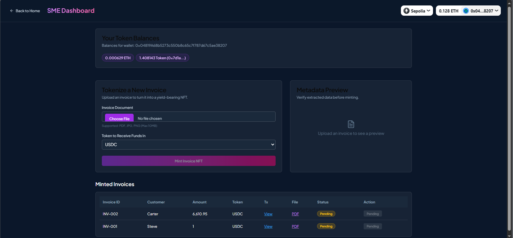
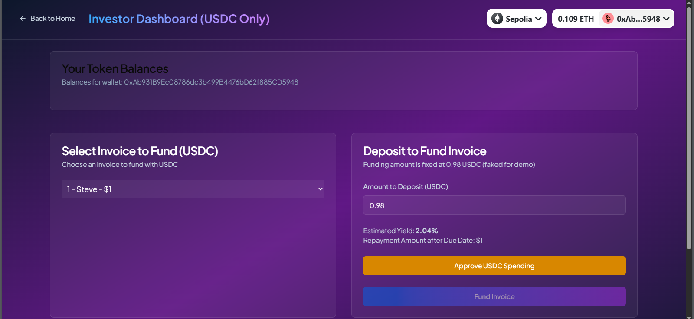
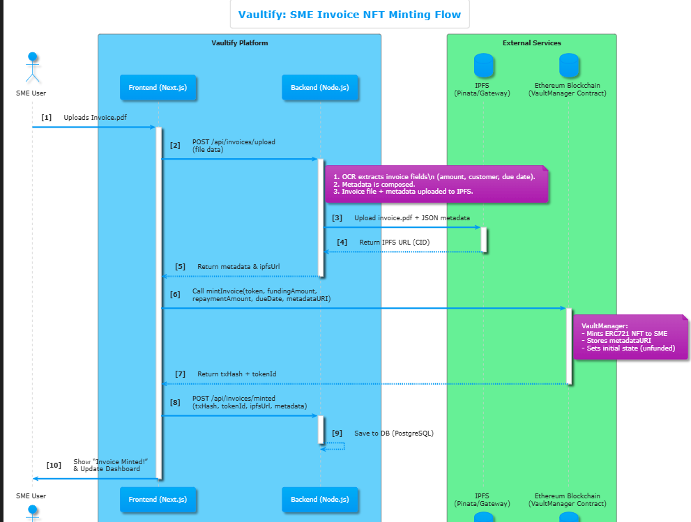
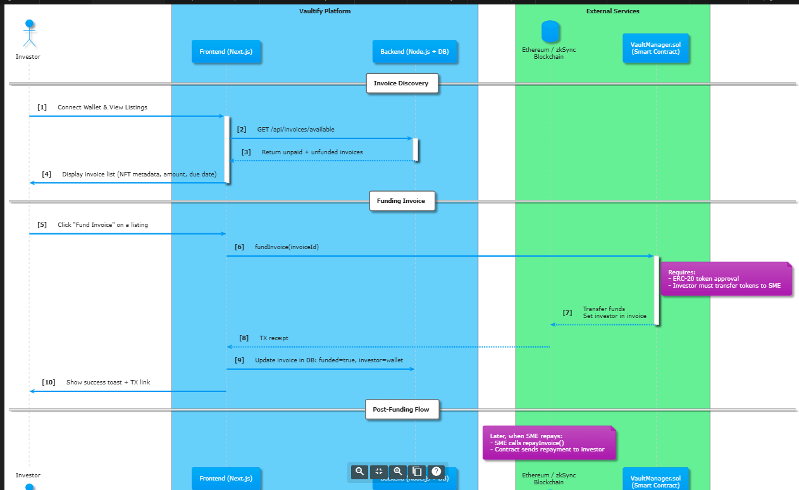

# Vaultify – Decentralized Invoice Financing Protocol

Vaultify is a Web3 protocol that allows small and medium enterprises (SMEs) to tokenize unpaid invoices as NFTs, making them fundable on-chain by crypto investors. It’s built on the Sepolia testnet and leverages 1inch APIs to allow real-time, flexible cross-token funding.

---

## 🧠 Problem Statement

Small businesses often face working capital issues due to delayed invoice payments. Vaultify allows them to mint those unpaid invoices as NFTs and access liquidity immediately by connecting with crypto investors willing to fund them. Using DeFi rails, invoices become investable on-chain assets.

---

## 🚀 Overview

> Real-world capital needs meet DeFi liquidity.

In traditional business, SMEs wait weeks or months to get paid. Vaultify enables tokenizing these invoices and allows anyone to fund them in crypto — with flexible token support and real-time price swaps powered by 1inch APIs.

---

## 🖼️ Demo Screenshots

**SME Dashboard**  
*Upload invoice, parse fields, and mint NFT*  


**Investor Dashboard**  
*Browse invoices and fund using supported tokens*  


**SME Flow**  
*High level diagram for SME flow*  


**Investor Flow**  
*High level diagram for Investor flow*  

---

## 🔁 How It Works

1. **Invoice Upload**: SME uploads a PDF invoice.
2. **OCR Parsing**: Backend extracts invoice fields like amount, due date, and customer name using Tesseract.
3. **NFT Minting**: The invoice is minted as an ERC-721 token on Sepolia, with metadata stored on IPFS.
4. **Investor Funding**: Investors can browse open invoices and choose to fund them in USDC, ETH, or other supported tokens.
5. **Token Conversion via 1inch**: Vaultify uses 1inch Quote and Swap APIs to convert investor-sent tokens into the SME's preferred token at real-time rates.
6. **Repayment & Closure**: SME repays, and the NFT can be marked repaid, archived, or burned.

---

## 📍 Where We Used 1inch APIs

1inch provides the backbone of Vaultify’s token flexibility. We used their APIs in the following parts:

| API                | Usage in Vaultify                                  |
|--------------------|----------------------------------------------------|
| `GET /v5.0/1/tokens` | To fetch supported tokens and addresses for UI dropdowns and validations. |
| `GET /v5.0/1/quote`  | To calculate real-time conversion from investor token (e.g., USDC) to SME's desired token (e.g., DAI). |
| `GET /v5.0/1/swap`   | To generate transaction data allowing investors to directly fund SMEs in their requested token via atomic swaps. |

These integrations make Vaultify flexible, seamless, and investor-friendly, abstracting away token conversion complexity.

---

## 🧱 Architecture

```plaintext
Frontend (Next.js + Wagmi + RainbowKit)
        |
FastAPI OCR Service (Tesseract)
        |
Backend APIs (Invoice parsing, 1inch integration)
        |
Smart Contracts (Sepolia, Solidity)
        |
Pinata / IPFS (Invoice + metadata storage)
